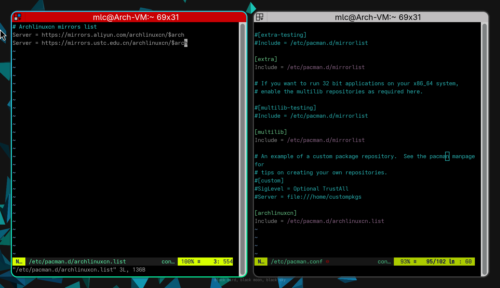

# ArchLinux 优化小技巧和使用体验优化

## 使用 Arch Linux CN 源

Arch Linux CN 源是由国内用户创建和维护的社区源，该源提供了大量适合国人使用的软件源，虽然默认 Arch Linux 官方源已经足够用户使用，但 Arch Linux CN 源能更好让你的操作系统符合你的需求。  
启动 Arch Linux CN 源需要修改`pacman`的配置文件，具体路径为`/etc/pacman.conf`。  
你可以参考中科大的[_这篇文章_](https://mirrors.ustc.edu.cn/help/archlinuxcn.html)，又或者将多个镜像源写入一个文件并引用。  


## 字体

默认情况下的 Arch Linux 是使用英文，如果你修改了用户环境为中文，你需要安装中文字体，通常情况下安装太多的中文字体会导致字体管理出现不可预料的问题，这里仅推荐安装谷歌的`note-fonts`。具体需要安装的字体会在下表列出。

|       包名       |                  用途                  |
| :--------------: | :------------------------------------: |
|    note-fonts    | 提供基础字体，包括基础中文、日文、韩文 |
|  note-fonts-cjk  |         提供全套中文、日文字体         |
| note-fonts-emoji |             提供全套 emoji             |
| ttf-font-awesome |              提供全套图标              |

## 有用的软件包

|      包名       |                                                                            用途                                                                             |
| :-------------: | :---------------------------------------------------------------------------------------------------------------------------------------------------------: |
|     pkgfile     | 当键入命令时无法找的对应命令时会自动检索官方软件包库并告诉你需要安装什么软件包，具体配置请[_参考_](https://wiki.archlinux.org/title/Bash#Command_not_found) |
| bash-completion |                                           当键入命令使用 Tab 快速补全能够自动检索可用参数和其他组合命令的实用工具                                           |
|     openssh     |                                            ssh 连接支持包，如果你需要远程连接到其他设备那么 ssh 是必不可少的工具                                            |
|    rdesktop     |                                       RDP 协议自持包，如果你需要远程连接到 Windows 设备那么 rdesktop 是必不可少的工具                                       |
|     clamav      |                  开源杀毒软件，在尽可能不占用过多系统资源情况下提供系统保护，需要用户手动[_配置_](https://wiki.archlinux.org/title/ClamAV)                  |
|     ranger      |                      一个基于命令行(CLI)的文件管理器，部分可选支持依赖请[_参考这里_](https://archlinux.org/packages/extra/any/ranger/)                      |

## Wayland 下使用 Electron 程序

由于 Wayland 是新的桌面中间层，许多软件或底层虽支持 Wayland 但可能出于兼容性考虑不会直接使用 Wayland 渲染方式，如 Electron。  
对于该情况你需要在本地用户配置文件中写入一些配置来启用对 Wayland 的支持。

为此只需要在`~/.config/electron-flages.conf`下写入下面的设置便可让基于 Electron 的程序运行在 Wayland 下。

```conf
--enable-features=WaylandWindowsDecorations
--ozone-platform-hint=auto
```

## CLI 环境下的编辑器

如 VIM 等编辑器实际上是支持插件扩展，通常情况下你仅需要一个包即可使得相对传统的编辑器拥有先进功能，如看行号、文件编码、文件类型等等。  
VIM 仅需要装`vim-airline`，便可实现如查看文件编码、git 项目关联、文件类型、编辑状态查看。  
当然你也可以查阅相关资料去了解你使用的 CLI 编辑器的插件。
