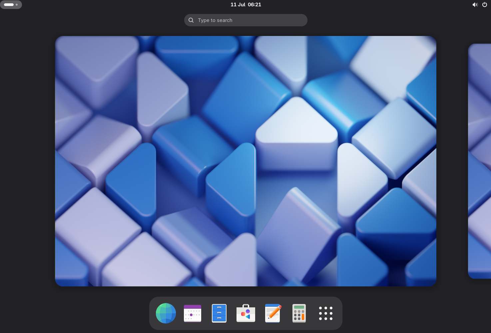
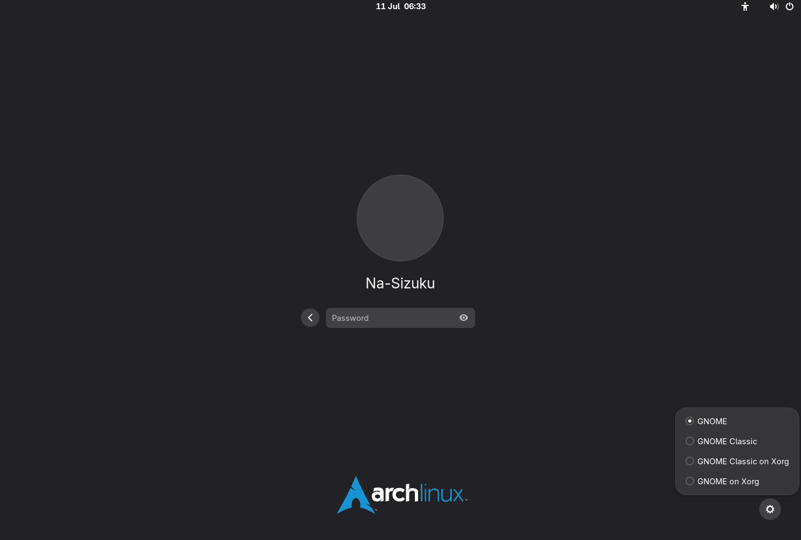
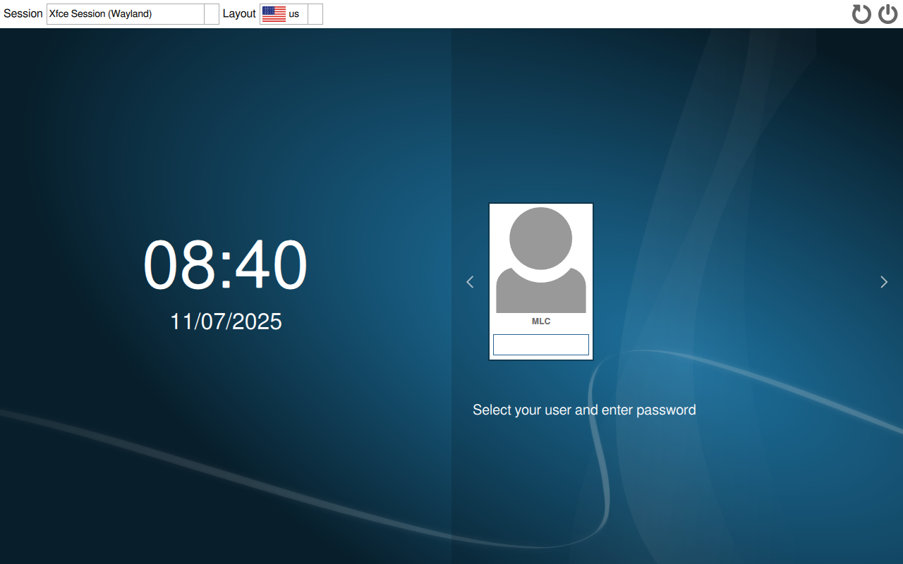
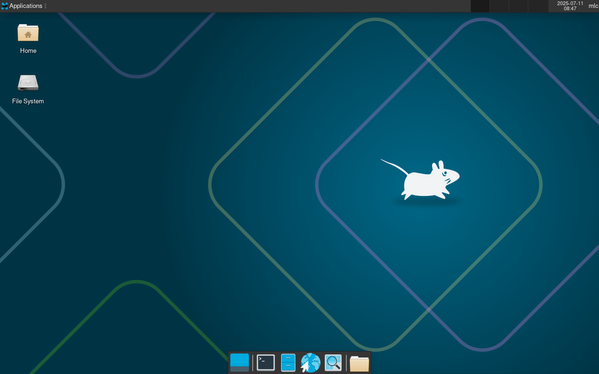
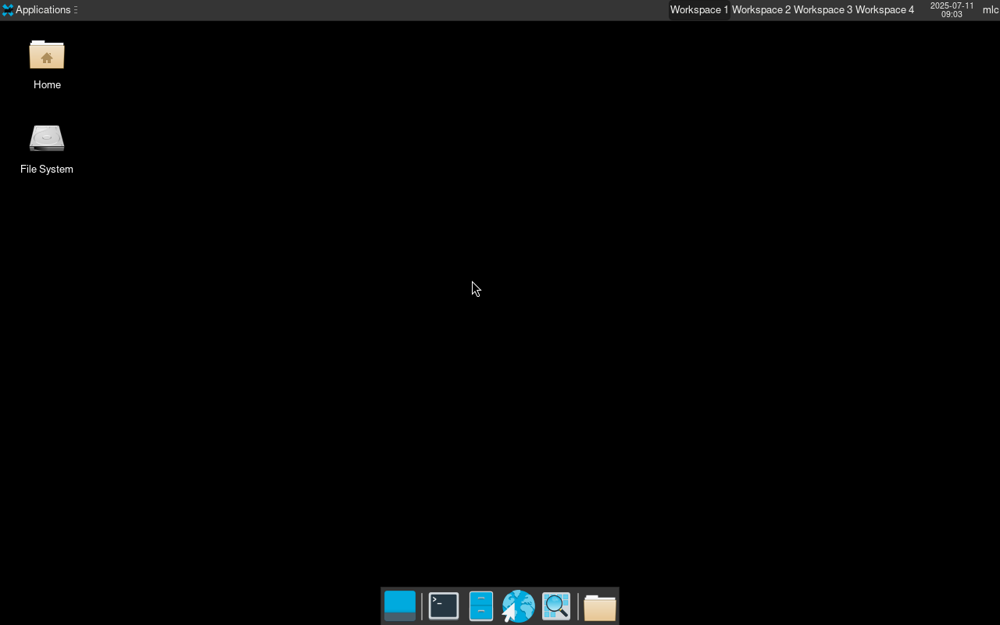

# Arch Linux 桌面安装

对于新安装的操作系统来说，桌面环境是完全没有的，为此你需要安装许多软件包来搭建你的桌面环境。  
通常情况下你可以安装如 GNOME 这样的桌面环境，并仅通过简单配置就能或一个相对现代化的桌面，又或者通过一些列折腾，最终获得一个你喜欢的你想要的桌面环境。  
本文将会通过一个相对复杂且折腾的例子讲解如何配置一个自己想要的桌面环境。

在正式进入安装桌面环境前，我们需要先配置后基础的东西`图形驱动`，我会在下列表格中列出图形驱动，你仅需要更具你的情况安装相应的包即可。

|     品牌     | 类型 |    DRM 驱动     |        OpenGL         |     Vulkan     |      DDX 驱动      |
| :----------: | :--: | :-------------: | :-------------------: | :------------: | :----------------: |
| AMD (ex-ATI) | 开源 | 包含在 Linux 中 |         mesa          |     amdvlk     | xf86-video-amdgpu  |
|     ATI      | 开源 | 包含在 Linux 中 |         mesa          |     amdvlk     |   xf86-video-ati   |
|    Intel     | 开源 | 包含在 Linux 中 |         mesa          |  vulkan-intel  |  xf86-video-intel  |
|    NVIDIA    | 开源 | 包含在 Linux 中 |         mesa          | vulkan-nouveau | xf86-video-nouveau |
|    NVIDIA    | 专有 |   nvidia-open   | nvidia 或 nvidia-open |  nvidia-utils  |    nvidia-utils    |

如果你不确定你的显卡是哪一个品牌的，你可以使用"lspci -d ::03xx"来查看你的设备中所拥有的显卡。

```bash
    lspci -d ::03xx
    #如果你是虚拟环境
    00:0f.0 VAG compatible controller: VMware SVGA II Adapter   #VMware 虚拟机显卡
    #如果你是实体机环境
    00:02.0 VGA compatible controller: Intel Corporation HD Graphics 630 (rev 04)   #CPU的核显
    01:00.0 3D controller: NVIDIA Corporation GP107M [GeForce GTX 1050 Mobile] (rev a1) #独立显卡
```

接下来只需要根据系统展示的内容安装`图形驱动`即可，如果你是虚拟机直接安装"mesa"包，如果你用 N 卡或者 A 卡又或者只有核显那么仅需要更具展示内容安装上表提供的软件包安装即可，通常情况下你只需要安装 OpenGL 和 DDX 驱动即可。

以下是常见的桌面环境，你可以在搜索引擎上搜索对应桌面环境的图片，挑选一个你所喜欢的，如果下列表格中没有列出你也可以查阅官方 wiki 进行配置。  
桌面环境都需要底层的渲染器（中间层）支持，通常来说在 Linux 上是使用 Xorg，当然最近几年也有新起的 Wayland。

需要注意的是 Xorg 是相对传统的中间层支持，但由于 Xorg 采用 C/S 架构（客户端-服务器架构），通讯路径、内存开销、内存安全以及软件构成架构等等存在或多或少的历史遗留问题，但 Xorg 胜在兼容性强、支持文档齐全这些优势。考虑到 Xorg 是从上世纪 90 年代就存在的中间层部分配置相对来说会比较复杂，以及存在部分内存安全性问题，如果可以请尽量选择使用 Wayland。

Wayland 作为新兴的中间层支持采用基于协议的结构，优化了 Xorg 的通讯路径较长、内存开销过大以及安全性的问题，但由于 Wayland 是新技术在一定程度上存在兼容性问题，或不支持 Xorg 的一些高级功能，又或者采用"XWaylangd"转义部分应用等问题，可能在一定程度上对于用户体验来说不会特别好。  
考虑到目前的 Linux 社区发展情况，使用 Wayland 是富有前瞻性的，如红帽的 RHEL 已经完全依赖于 Wayland，KDE、GNOME 已经明确将会迁移且默认使用 Wayland 作为中间层。

本文将不会专注于其中一个中间层来讲解，而是将会同时讲解 2 种不同中间层配置和桌面环境搭建，你可以根据你的需求选择任意中间层来配置你的桌面环境，如果你考虑兼容性、稳定性那么 Xorg 是一个不错的选择，如果你喜欢更现代化、更强大、效率更好的中间层你可以选择 Wayland，又或者两个都安装在登录界面选择你想要的使用的中间层。

考虑到 Wayland 作为行业趋势逐步替代老久的 Xorg，在绝大部分情况下安装如 GNOME、Xfce 这一类的桌面环境时都会同时安装 Xorg 和 Wayland。对于平铺式的桌面环境则需要根据你选择的中间层安装和配置。

|    桌面环境名    | Xorg 支持 | Wayland 支持 | Wayland 支持所需软件包 |
| :--------------: | :-------: | :----------: | :--------------------: |
|  GNOME(窗口式)   |    是     |   是(默认)   |     xorg-xwayland      |
|   Xfce(窗口式)   |    是     |  实验性支持  |  xorg-xwayland、labwc  |
|    i3(平铺式)    |    是     |      否      |           -            |
| Hyprland(平铺式) |    否     |      是      |     xorg-xwayland      |

注意：安装 xwayland 是出于兼容性考虑，除非你真的知道你使用的所有均能正常使用 Wayland 否则请一定要 xwayland 作为对老应用的支持。

当然只有桌面环境也仅仅是你拥有了桌面，启动桌面环境任然需要相应的窗口管理器，在本文只会使用"sddm"如果你有其他你喜欢的窗口管理器也可以自行替换使用，如果你使用"GNOME"作为你的桌面环境你仅需要启用"Gnmoe"自带的"gdm"即可，当然你也可以不使用窗口管理器，直接使用命令行启动，具体配置将会在下面几个章节中进行讲解。

**由于本文仅介绍桌面环境安装，桌面环境配置完成后的其他设置还请自行你的桌面环境和软件，对于日常使用的软件你可以参考[_最后一章_](../ArchLinux/ArchLinux%20Install_Desktop.md#其他文章参阅)。**

## 窗口式桌面环境

### GNOME

GNOME 是一个简单易用的桌面环境，由 GNOME 项目团队设计。它是完全由免费开源的软件组成，默认使用 Wayland 而不是使用 Xorg。  
从 GNOME 40 开始，由于 Wayland 的技术成熟 GNOME 将其作为默认中间层。虽然 Xorg 任然受到支持，但将会在 GNOME 50 中移除对 Xorg 的支持，具体信息你可以查看此[_文章_](https://gitlab.gnome.org/GNOME/gnome-session/-/merge_requests/98)。

由于 GNOME 项目团队在逐步将 GNOME 桌面环境迁移至 Wayland，默认情况下安装"gnome"包将会自动安装 Wayland 和 Xorg 中间层，如果不想配置太多其他软件或者懒得去找其他软件来搭建你的桌面环境，你可以再安装一个"gnome-extra"包。  
输入下列的命令即可安装 GNOME，安装过程中 pacman 会询问你需要安装那些软件包，如果你是新手你可以默认全部安装，当然你可以选择你需要的软件包安装。

```bash
    pacman -Syu gnome  #如果你是root用户
    sudo pacman -Syu gnome #如果你是普通用户
```

接下来仅需要等待 pacman 自动下载所需软件包安装即可。  
完成安装后你需要一个窗口管理器来管理桌面环境和用户登录，GNOME 自带一个窗口管理器"GDM"，只需要为其配置开机自启动就大功告成。

```bash
    systemctl enable gdm    #如果你是root用户
    sudo systemctl enable gdm   #如果你是普通用户
```

完成配置后仅需要重新启动设备，便可以自动进入桌面环境的登录界面。  


选择你需要的用户登录用户，输入密码即可登录进入你的桌面环境。  


如果你想切换 GNOME 使用的渲染中间层，你只需要在选择好用户后点击左下角的小齿轮修改你想用的中间层即可。  


- GNOME 选项是使用 Wayland 渲染中间层
- GNOME Classic 选项则是复刻传统 GNOME2 的样子和使用体验
- GNOME Classic on Xorg 选项则是使用 Xorg 渲染中间层复刻传统 GNOME2 的样子和使用体验
- GNOME on Xorg 选项是使用 Xorg 渲染中间层

接下来你就可以在桌面环境中修改设置、添加主题来使得你的桌面环境更符合你的需求，调教出你喜欢的桌面。

### Xfce

Xfce 是基于 GTK 的轻量级模块化桌面环境，在默认情况下带有一套基础且完整的桌面环境，能够满足最基础的需求。  
考虑到 Xfce 团队对于 Wayland 的支持，这里不是很推荐使用 Wayland 作为你的中间层，Xfce 团队将 Wayland 支持作为实验性支持的主要原因是有些模型在 Wayland 上的工作状态不是很正常或不是很稳定，但本文中任会继续说明。

安装 Xfce 仅需要安装"xfce4"包组，但这里推荐同时也安装"xfce4-goodies"包组，该包组提供了大量实用工具能让你配置 Xfce 桌面环境更为轻松方便。  
你只需要根据下列的命令安装 Xfce 即可。

```bash
    #如果仅使用Xorg
    pacman -Syu xfce4 xorg sddm #如果你是root用户
    sudo pacman -Syu xfce4 xorg sddm    #如果你是普通用户
    #如果要使用Wayland
    pacman -Syu xfce4 labwc sddm    #如果你是root用户
    sudo pacman -Syu xfce4 labwc sddm   #如果你是普通用户
```

接下来仅需要等待 pacman 自动下载所需软件包安装即可。  
完成安装后你需要将"sddm"设置为开机自启动，接下来只需要重新启动设备便会自动进入 SDDM 的登录界面。

```bash
    systemctl enable sddm   #如果你是root用户
    sudo systemctl enable ssdm  #如果你是普通用户
```



选择你的用户并输入密码后即可进入 Xfce 桌面。  
注意：如果使用 Wayland 作为中间层，请一定要记得在右上角修改为"Xfce Session (Wayland)"。  
注意：如果使用 Xorg 作为中间层请一定要记得在右上角修改为"Xfce Session"。

使用 Xorg 作为中间层


使用 Wayland 作为中间层


需要注意的是由于 Xfce 对 Wayland 的支持不是特别好，所以你可以看见在 Xorg 上的 Xfce 能正常显示桌面背景但在 Wayland 上面无法正常显示桌面背景。

接下来你就可以在桌面环境中修改设置、添加主题来使得你的桌面环境更符合你的需求，调教出你喜欢的桌面。

## 平铺式桌面环境

平铺式桌面环境基本都有几个特点，组件简单、高扩展性、高定制性、低占用开销。默认情况下的平铺式桌面都是简单朴素且没有过多复杂功能，这也意味着完全配置好一个平铺式桌面会很有成就感。  
由于平铺式桌面没有过多复杂功能，所以在安装的时候你需要配套安装其他桌面应用来丰富你的体验，从最基础的终端界面、快速启动到美化工具等等都需要你手动安装和配置。  
同样的基于平铺式桌面的高扩展性，完整配置好一个平铺式桌面环境会需要一定的时间和精力，如果你喜欢全键盘操作和有闲心去配置，那么平铺式桌面对于你来说是最好的选择。

对于平铺式桌面所需要的其他扩展和必备软件在本文中会更具情况进行说明，本文将会带你配置最基础的平铺式桌面环境，其他东西你可以参阅 wiki 或查看其他人配置的平铺式桌面环境。  
需要注意的是，由于平铺式桌面对于鼠标的需求是可有可无，如果你使用平铺式桌面，那么就需要做好配置大量的键盘快捷键，默认情况下的快捷键也会在不同桌面环境下进行讲解，同时也会对配置文件进行一定说明。  
你可以参考说明进行配置，又或者根据你的需要重新编写你的配置文件。

### i3

由于 i3 本身不支持 Wayland，所以 i3 将仅使用 Wayland 作为中间层。  
关于 i3 不支持 Wayland 你可以查看[_本文_](https://github.com/i3/i3/discussions/5845)。  
作者已经明确表示 i3 不会从 Xorg 切换到 Wayland，但同样的只要 i3 有用户作者就会一直维护该项目，同时考虑到部分远程桌面和虚拟桌面任在使用 Xorg，所以 i3 仅保留对 Xorg 的支持，同时平铺式桌面在 Wayland 上已经有平替。

i3 是在 Xorg 下的一款平铺式桌面，由于 i3 作者秉承简单、简洁的理念，初始安装的 i3 桌面环境会非常的朴素传统，甚至于连终端环境、快速启动等等功能都没有，为此安装 i3 的时候你需要一并安装其他工具、软件来构建一个拥有完整桌面体验的环境。  
本文中会进行详细说明同时也会在安装过程中告诉你具体需要那些东西来构成，同时也会对部分初始化配置进行说明，避免对平铺式桌面的初次使用的摸不到头脑或不知道该如从下手。

### Hyprland

由于 Hyprland 本身不支持 Xorg，所以 Hyprland 将仅使用 Wayland 作为中间层。

## 关于手动启动桌面环境

一般情况下是极其不推荐通过命令行启动你的桌面环境，除非你是真的闲的慌！

## 其他文章参阅

关于**常用软件**请参阅这篇[_文章_](../ArchLinux/ArchLinux%20Extend_Common%20Software.md)  
关于**办公软件**请参阅这篇[_文章_](../ArchLinux/ArchLinux%20Extend_Office%20Software.md)  
关于**开发软件**请参阅这篇[_文章_](../ArchLinux/ArchLinux%20Extend_Development%20Software.md)  
关于**日常使用及优化**请参阅这篇[_文章_](../ArchLinux/ArchLinux%20Extend_Optimize.md)
