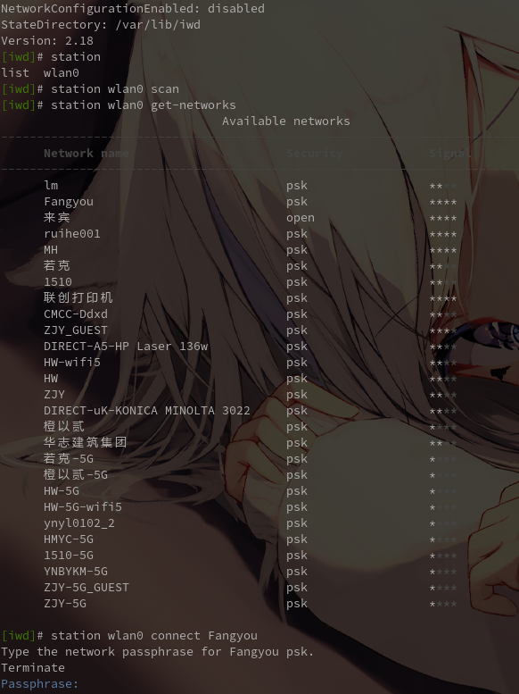
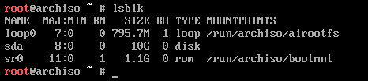

# Arch Linux 安装

## Arch Linux 官方提供快速安装脚本

虽然官方提供了自动安装脚本，但在本文中不会过多介绍和讲解如何使用。  
如果需要使用请自行点击下面的链接访问对应页面查看。  
自动安装脚本介绍页面（英文）: <https://wiki.archlinux.org/title/Archinstall>  
自动安装脚本介绍页面（中文）: <https://wiki.archlinuxcn.org/wiki/Archinstall>  
自动安装脚本使用页面（英文）: <https://archinstall.archlinux.page/installing/guided.html>

## Arch Linux 手动安装

手动安装 Arch Linux 一直是官方鼓励使用的方式，这样你不仅可以知道在安装过程中出现的各种问题，同时也可以根据需要自定义需要安装的软件包。  
在正式安装操作系统前，你需要知道 GPT 分区和 MBR 分区的特点，这不仅影响你后面引导操作系统的方式，同时也影响你系统的安全性。  
在本文中不会过多赘述 GPT 分区和 MBR 分区的特点，以及如何影响操作系统，如果需要可以点[这里](https://sizuku.privatecloud.fun:14444/Na-Sizuku/sizuku-study-doc/-/blob/master/Extend/Disk%20Partition.md)

### 准备系统安装镜像

Arch Linux 系统镜像你可以从官方网站获取，也可以通过镜像服务器获取，通常情况下推荐从镜像服务器获取，因为下载的速度更快。  
你可以从这里获取完整的镜像服务器[列表](https://archlinux.org/download/)，并根据自身所处的位置进行选择。  
如果你在国内，可以参考下面列表里展示的几个镜像服务器，并根据自身情况进行选择。

|                    站点(国内各大企业)                    | 最大速率(MB/s) |                       站点(国内各大高校)                        | 最大速率(MB/s) |
| :------------------------------------------------------: | :------------: | :-------------------------------------------------------------: | :------------: |
|   [阿里云](https://mirrors.aliyun.com/archlinux/iso/)    |      1000      | [中国科学技术大学](https://mirrors.ustc.edu.cn/archlinux/iso/)  |      1000      |
|  [华为](https://mirrors.huaweicloud.com/archlinux/iso/)  |      1000      | [清华大学](https://mirrors.tuna.tsinghua.edu.cn/archlinux/iso/) |      1000      |
| [腾讯](https://mirrors.cloud.tencent.com/archlinux/iso/) |     10000      |      [北京大学](https://mirrors.pku.edu.cn/archlinux/iso/)      |     10000      |
|      [网易](https://mirrors.163.com/archlinux/iso/)      |     20000      |                                -                                |       -        |

下载好系统镜像后记得下载 sha256sum.txt 用于对比文件 hash 值，这不仅仅是避免文件在下载的时候被修改，同时也是避免下载后的文件损坏。  
对于 Windows 操作系统你可以使用下面的命令进行校验。

```powershell
    CertUtil -hashfile <文件名/文件路径> sha256
```

对于 Linux 操作系统你可以直接使用 sha256sum 命令进行校验。  
如果你已使用 Arch Linux 作为你的操作系统，为什么还要来看安装指北，你应该去看官方 Wiki。

```bash
    sha256sum -c sha256sums.txt
```

当然你也可以跳过文件校验制作系统镜像 U 盘或光盘。

### 验证网络连接

Arch Linux 官方提供的镜像不包含任何软件包，这也意味着安装操作系统需要全程联网。  
对于有线连接的设备镜像在启动后将会自动使用 DHCP 获取网络，如果你在特定的网络环境下，你可能需要配置固定 IP 来连接网络。

```bash
    ip addr add <IP地址>/<子网掩码前缀> brd <广播地址> dev <接口名字>
    ip addr add 192.168.1.201/24 brd 192.168.1.255 dev ens192
```

上述命令是用于配置静态 IP 地址，需要注意静态 IP 地址不能和 DHCP 获取的 IP 地址一致，不然会提示地址已经使用。  
这里没用使用 net-tools 包里的 ifconfig 命令，这是由于 net-tools 包存在的一些问题，目前官方镜像不提供使用 net-tools 提供的命令如 ifconfig 等，转而使用的是 iproute2 提供的命令，对应的命令改变将在下表体现。

| 弃用的命令 |                                      替换命令                                       |
| :--------: | :---------------------------------------------------------------------------------: |
|    arp     |                                 ip n (ip neighbor)                                  |
|  ifconfig  |                     ip a (ip addr), ip link, ip -s (ip -stats)                      |
|  iptunnel  |                                      ip tunnel                                      |
|  iwconfig  |                                         iw                                          |
|   nameif   |                                  ip link, ifrename                                  |
|  netstat   | ss, ip route (for netstat-r), ip -s link (for netstat -i), ip maddr (for netstat-g) |
|   route    |                                   ip r (ip route)                                   |

如果你使用 WiFi 作为网络接入，你将需要使用 iwd 包的 iwctl 进入 WiFi 连接 CLI 界面。

```bash
    station <设备名称> scan
    station <设备名称> get-networks
    station <设备名称> connect <网络名称>
```



在完成网络配置后一定要记得 ping 一下，比如 baidu.com

### 磁盘分区

自 2012 年后的计算机主板基本都支持了 EFI 引导，在磁盘分区中将优先考虑使用 GPT 分区而不优先考虑使用 MBR 分区。  
如果你不确定你的电脑是否支持 EFI 引导，你可以通过下列命令进行验证。

```bash
    cat /sys/firmware/efi/fw_platform_size
```

需要注意的是如果你的 BIOS 没有设置 EFI 引导，命令可能无法执行。  
对于磁盘分区，推荐使用 fdisk 进行操作，当然你也可以根据需要选择其他自己熟悉分区工具，本文将使用 fdisk 作为演示。  
在安装镜像中执行 lsblk 用于查看计算机中磁盘详细信息，如安装了几块磁盘，有哪些磁盘已经分区，磁盘挂载点等等。  
  
在演示中使用的磁盘为 sda，实际安装中还请参考 lsblk 命令执行结果，并`根据情况`修改命令的**参数**。  
使用 fdisk 对 sda 磁盘进行修改，当键入命令后将会进入 fdisk CLI 界面。

```bash
    fdisk /dev/<磁盘名称>
```

  
默认情况下 fdisk 会自动创建一个 DOS 分区表既 MBR 分区表，如果你的系统已经支持了 EFI 引导，那么请输入 g 并回车执行创建 GPT 分区表。  
如果不知道怎么操作请根据提示键入 m 并回车执行，fdisk 将会告诉你可用的操作。  
  
接下来你可以根据你的需要进行相应的分区工作，如果看不动英文你可以参考[此处](https://wiki.archlinuxcn.org/wiki/Fdisk#%E5%88%9B%E5%BB%BA%E5%88%86%E5%8C%BA%E8%A1%A8%E5%92%8C%E5%88%86%E5%8C%BA)，这里是 ArchLinux 中文社区 Wiki，讲述了如何操作 fdisk 进行磁盘分区。

你可以根据下表来创建分区和规划大小，默认情况下/home 和/root 是直接在根分区(/)下面创建的，如果你需要将用户家目录(/home)进行独立分区，你可以根据需要酌情减少根分区大小。  
如果你使用 Arch Linux 作为你的主力操作系统，推荐将用户家目录分区进行独立，这样当你需要重新安装操作系统的时候，用户数据将不会丢失。  
如果你不清楚 Linux 文件结构的特点，那么你可以参考该视频[100 秒解释 Linux 系统目录结构](https://www.bilibili.com/video/BV1y3411t7Tz/)，如果你在海外可以参考[Linux directories in 100 seconds](https://youtu.be/42iQKuQodW4)

| 系统挂载点 |              分区类型              |         推荐大小         |                                        用途                                         |
| :--------: | :--------------------------------: | :----------------------: | :---------------------------------------------------------------------------------: |
|   /boot    | EFI 系统分区(EFI system partition) |        300Mb 起步        |    用于给 EFI 引导准备的特殊分区，如果使用 MBR+传统 BIOS 引导可以则不需要该分区     |
|   [SWAP]   |     Linux 交换分区(Linux swap)     | 4G 起步，最好为 2 的倍数 | 当系统内存不够用时作为虚拟内存使用，如果内存大于 8G 可酌情考虑，大于 16G 则可不需要 |
|     /      |  Linux 文件系统(Linux filesystem)  |      最少 20G 起步       |                   作为系统的根分区，最好和/boot 分区在同一磁盘下                    |
|   /home    |  Linux 文件系统(Linux filesystem)  |   可以根据需要进行创建   |           作为用户家目录的挂载点，如果不单独分区则需要加大系统根分区大小            |
|   /root    |  Linux 文件系统(Linux filesystem)  |   可以根据需要进行创建   |    作为 root 特权用户的家目录挂载点，如果不单独进行分区则需要加大系统根分区大小     |

作为演示，下面是一个已经完成分区的磁盘，由于演示系统作为服务器使用，故此没有创建如 /home 等专用分区，根分区也并没用根据推荐进行创建。

```bash
    NAME   MAJ:MIN RM   SIZE RO TYPE MOUNTPOINTS
    sda      8:0    0    16G  0 disk
    ├─sda1   8:1    0   300M  0 part
    ├─sda2   8:2    0     4G  0 part
    └─sda3   8:3    0  11.7G  0 part
    sr0     11:0    1   1.1G  0 rom  /run/archiso/bootmnt
```

完成磁盘分区后，记得要为你新分区的磁盘进行格式化。你可以将磁盘理解为地皮，分区是在地皮上面划分地基，而格式化就是在地基上面盖仓库，而写入文件就是往仓库里搬东西。

格式化磁盘可以使用 mkfs 命令，先前我们创建了 3 个分区，其中 sda1 要作为启动分区，sda2 作为交换分区，sad3 则作为我们的系统根分区。  
这里我们需要用到命令均在下面列出。

```bash
    mkfs.fat -F 32
    mkswap
    swapon
    mkfs.ext4
```

mkfs.fat 是用于给引导分区格式化使用的命令，-F 32 是用于创建 FAT32 文件系统的参数，对于 BIOS 来说 FAT 文件系统是目前且唯一能读取的文件系统，如果格式化使用了其他文件系统进行格式化则有可能会导致操作系统无法引导或其他不可预料的问题 。  
mkswap 是将分区设定为交换分区，swapon 则是启用交换分区 。  
mkfs.ext4 将分区格式化为 Linux 系统常用文件系统，ext 文件系统目前有 ext2 ext3 和 ext4，对于较新的 Linux 操作系统来说，使用 ext4 则会有相对较好的性能，如果想要使用其他文件系统如 btfs、xfs 等还需要其他配置，这里则使用 ext4。

```text
    root@archiso ~ # mkfs.fat -F 32 /dev/sda1
    mkfs.fat 4.2 (2021-01-31)
    root@archiso ~ # mkswap /dev/sda2
    Setting up swapspace uersion 1, size = 4 GiB(4294963200 bytes)
    nolabel, UUID=a43c3479-7f45-49f7-9e10-Zaaf116c709b

    root@archiso ~ # swapon /dev/sda2

    root@archiso ~ # mkswap /dev/sda3
    Creating filesystem with 4116992 4k blocks and 1030176 inodes
    Filesystem UUID:583a2157-11ec-4460-952a-ff4c798a80cZ
    Superblock backups stored on blocks:
        32768，98304，163840，229376，294912,819200，884736，1605632，2654208,
        4096000
    Allocating group tables : done
    Writinginode tables : done
    Creating .journal (16384 blocks) :done
    Writing superblocks and filesystem accounting information: done

    root@archiso ~ #
```

通过上述操作，已经完成了磁盘格式化及交换分区启用，接下来需要进行挂载磁盘为安装系统做准备。

### 挂载分区

挂载分区前首先我们需要知道我们需要挂载的分区的具体位置，可以通过 lsblk 命令进行查看。

```bash
    NAME   MAJ:MIN RM   SIZE RO TYPE MOUNTPOINTS
    sda      8:0    0    16G  0 disk
    ├─sda1   8:1    0   300M  0 part
    ├─sda2   8:2    0     4G  0 part [SWAP]
    └─sda3   8:3    0  11.7G  0 part
    sr0     11:0    1   1.1G  0 rom  /run/archiso/bootmnt
```

这里我们需要挂载 sda1 和 sda3，其中 sda1 是我们的引导分区，需要挂载到"/boot"下面，sda3 是我们的根分区需要挂载到"/"下面去，但由于我们在安装镜像提供的基础系统里，所以这里我们需要将 sda1 挂载到"/mnt/boot"而 sda3 挂载到"/mnt"下。  
这里我们使用"mount"命令进行挂载，挂载到不存在的位置时可以通过携带"--mkdir"参数来创建并挂载到指定目录。


由于 Arch Linux 并不会在安装镜像中提供任何安装包，所以接下来我们需要配置安装系统的镜像源来加快我们的下载速度。

### 配置镜像源

Arch Linux 使用 pacman 作为包管理器，对应配置文件在"/etc/pacman.conf"和"/etc/pacman.d/"当中，修改镜像源需要编辑位于"/etc/pacman.d/mirrorlist"文件，默认会提供几个镜像源，为了保证速度我们这边会将其都禁用并单独写入一个新的镜像源。

您可以手动配置镜像源到上面的任意一个镜像服务器，也可以在文件中取消注释掉离你最近或者速度最快的服务器。  
您可以使用下列任意一个命令对配置文件进行编辑，对于初次尝试使用 Linux 的用户来说建议使用 nano 作为你的文本编辑器，如果你有使用 Linux 的经验，你可以选择你常用的文本编辑器进行编辑。

```bash
    #你可以选择任意一个适合你的文本编辑器对配置文件进行编辑
    #vim/vi文本编辑器为纯键盘操作编辑器，具有一定上手难度
    vim /etc/pacman.d/mirrors
    #nano文本编辑器
    #nano拥有着相对现代化的操作逻辑和快捷键，时候新手使用
    nano /etc/pacman.d/mirrors
```


这里我们使用中国科学技术大学作为我们的镜像源，完成配置后我们还需要进行一次系统更新以获取最新数据和安装包数据库，执行下列命令即可自动更新。

```bash
    pacman -Syy
```

完成这些操作后就可以进行基础系统安装。

### 安装基础系统

由于 Arch Linux 所追求的 KISS 理念，所以请务必仔细阅读接下来的几个章节，以*避免*安装后**无法引导系统**，无法**连接网络**，**无法使用使用其他功能**等情况。  
基于 Arch Linux 的 KISS 理念，操作系统安装将会是完全模块化按需求安装，您需要知道您的设备的具体硬件配置，才能保证安装过程中不出现如丢失依赖的情况，同时安装过程中请确保全程联网，所有你需要的软件包都将会自动通过网络下载。

Arch Linux 使用"pacstrap"命令安装全新的操作系统，一个完整的安装命令由下面进行展示。

```bash
    pacstrap -K /mnt base linux linux-firemware
    pacstrap <参数> <安装挂载点> <软件包>
```

通过上述命令，我们会安装一个全新的操作系统，该操作系统将不会携带任何来自于 ISO 安装镜像的配置，但由于安装的包仅带有基础操作系统，连文本编辑器都没有，甚至于上网功能都有可能会出现问题，为此我们需要补足其他需要的安装包，或者使用"arch-chroot"命令进入新安装的操作系统进行配置和安装。

下面有一些可以参考的软件包，从内核到文本编辑再到网络连接等都会囊括，但如桌面等其他现代化办公和使用需要的软件包在此并没有提供，可以参考最一章进行安装。

#### 安装时必要的软件包类型

本章节将会着重讲解一个初始操作系统所需要的基础软件包。  
下述表格列出的软件包需要根据您的具体情况进行替换或添加，如驱动类型的软件包如果你拥有显卡或者拥有其他类型的网卡等需要额外安装其他软件包，如果使用如 LVM 或软 RAID 等磁盘管理你可能还需要安装其他软件包使得内核支持，您可以参阅下面其他小章节以获取更多更详细的信息来完成你的安装。  
基础库是必须要按照的，该库提供了一系列软件和工具如基础网络工具，pacman 包管理软件等等。  
基础编译库在这里列为必要软件包是考虑到后续日常使用中你可能需要安装三方软件包，该库提供了一些列所必要的软件如 gcc 等以满足编译软件的需求。  
命令帮助手册仅安装 man 就已经足够，将不会在下面列出可以替代的软件包。

|       类型       |                                    功能                                    |  示例软件包名  |
| :--------------: | :------------------------------------------------------------------------: | :------------: |
|      基础库      |                         提供基础 Linux 工具命令等                          |      base      |
|    基础编译库    |                   提供基础编译软件功能或安装三方软件功能                   |   base-devel   |
|   CPU 微代码库   |               针对不同厂商的 CPU 提供的优化、安全和性能提升                |  intel-ucode   |
|       内核       |                                操作系统内核                                |     linux      |
|       驱动       |                       用于给硬件提供调用功能并使用等                       | linux-fireware |
|   系统引导软件   |                        用于引导操作系统所需要的软件                        |      grub      |
| 基础文本编辑工具 |                在命令行模式（CLI）下提供文本编辑功能的软件                 |      vim       |
|   网络管理工具   |                         提供网络连接管理功能的软件                         |     dhcpcd     |
|   用户提权工具   | 在默认情况下普通用户是没有权限执行 root 权限下的命令，需要提权工具进行管理 |      sudo      |
|   命令帮助手册   |             用于在使用命令不知道具体参数的情况下进行查阅的软件             |      man       |

#### CPU 微代码库

CPU 微代码库一般是提供 CPU 的安全支持和一些 BUG 修复，如果你使用虚拟机则不需要安装，如果你为你的笔记本电脑、台式机或服务器安装 Arch Linux 则你需要安装微代码库以确保你的系统安全和系统稳定性。

| 针对的 CPU 厂商 |  软件包名   |
| :-------------: | :---------: |
|       AMD       |  amd-ucode  |
|      Intel      | intel-ucode |

#### 可选系统内核

安装多个内核在不同使用场景下切换是可行的，但考虑到本文的初衷是安装一个适合个人使用的 Arch Linux 故在此不提倡安装多个不同的内核。  
在 Arch Linux 官方支持中的内核会支持所有可以使用的内核模块，如 Selinux Apparmor 等安全类型模块，如果您需要安装三方内核则需要根据情况添加不同的引导参数以支持您所需要的功能，本文仅列出官方支持的内核。

|     内核名      |        软件包名        |                                                                                                                                                 特点                                                                                                                                                 |
| :-------------: | :--------------------: | :--------------------------------------------------------------------------------------------------------------------------------------------------------------------------------------------------------------------------------------------------------------------------------------------------: |
|     Stable      |         linux          |                                                                                                                              一个原版 Linux 内核和模块，应用了一些补丁                                                                                                                               |
|     Hardend     |     linux-hardend      |                                                                                        一个以安全为重点的 Linux 内核，应用了一组强化补丁来减轻内核和用户空间漏洞，比默认 linux 内核支持更多的上游内核强化功能                                                                                        |
|    Longterm     |       linux-lts        |                                                                               长期支持（LTS）Linux 内核和模块，在使用一些非官方外模块时很有用，这些模块可能无法及时发布与最新稳定内核兼容的版本，但能满足一些特殊需求                                                                                |
| Realtime kernel | linux-rt, linux-rt-lts | 由 Ingo Molnar 领导的一小群核心开发人员维护，这个补丁修改允许几乎所有的内核空间被抢占，除了一些非常小的代码区域（“raw_spinlock 关键区域”）。这是通过用支持优先级继承的互斥体替换大多数内核自旋锁，以及将所有中断和软件中断移动到内核线程来实现的$\color{#F00}{注意：该内核补丁已合并到Linux 6.12中}$ |
|   Zen Kernel    |       linux-zen        |                              这是内核黑客为日常系统提供最佳 Linux 内核而共同努力的结果。有关更多详细信息，请参阅[常见问题解答](https://github.com/zen-kernel/zen-kernel/wiki/FAQ)和[详细功能列表](https://github.com/zen-kernel/zen-kernel/wiki/Detailed-Feature-List)                               |

#### 驱动

驱动软件对于操作系统来说至关重要，缺少关键的驱动文件操作系统将无法调用对于的硬件，如缺少显卡(GPU)支持，声卡不工作等情况。  
在此会列出所有 Arch Linux 官方提供的驱动，通常情况下你的设备安装了对应的驱动后相应设备均可以工作，如果部分设备不工作可能需要你安装其他软件包或驱动包。

|        软件包名         |                 描述                  |                       依赖关系                       |
| :---------------------: | :-----------------------------------: | :--------------------------------------------------: |
|     linux-firmware      |               默认集合                |                          -                           |
|  linux-firmware-amdgpu  |          AMD Radeon 显卡固件          |                被 linux-firmware 依赖                |
| linux-firmware-atheros  | 高通 Atheros 无线网卡和蓝牙适配器固件 |                被 linux-firmware 依赖                |
| linux-firmware-broadcom |  Broadcom 和 Cypress 网络适配器固件   |                被 linux-firmware 依赖                |
|  linux-firmware-cirrus  |       Cirrus Logic 音频设备固件       |                被 linux-firmware 依赖                |
|  linux-firmware-intel   |            Intel 设备固件             |                被 linux-firmware 依赖                |
| linux-firmware-liquidio |   Cavium LiquidIO 服务器适配器固件    |              依赖 linux-firmware-whence              |
| linux-firmware-marvell  |           Marvell 设备固件            |              依赖 linux-firmware-whence              |
| linux-firmware-mediatek |         联发科和雷凌设备固件          |                被 linux-firmware 依赖                |
| linux-firmware-mellanox |     Mellanox Spectrum 交换机固件      |              依赖 linux-firmware-whence              |
|   linux-firmware-nfp    |       Netronome 流量处理器固件        |              依赖 linux-firmware-whence              |
|  linux-firmware-nvidia  |        NVIDIA 显卡和 SoC 固件         |                被 linux-firmware 依赖                |
|  linux-firmware-other   |         各类设备的未分类固件          |                被 linux-firmware 依赖                |
|   linux-firmware-qcom   |             高通 SoC 固件             | 依赖 linux-firmware-whence 和 linux-firmware-atheros |
|  linux-firmware-qlogic  |            QLogic 设备固件            |              依赖 linux-firmware-whence              |
|  linux-firmware-radeon  |          ATI Radeon 显卡固件          |                被 linux-firmware 依赖                |
| linux-firmware-realtek  |             瑞昱设备固件              |                被 linux-firmware 依赖                |
|  linux-firmware-whence  |      WHENCE 文件（供应商许可证）      |          被 linux-firmware 的其他包递归依赖          |

注意：  
被依赖的包在安装的同时也会同时安装对应的包，如安装"linux-firmware"则会同时安装所有被依赖的包如"linux-firmware-amdgpu"
被递归依赖的包如"linux-firmware-whence"在安装"linux-firmware"的依赖的包如"linux-firmware-amdgpu"所依赖

#### 系统引导软件

系统引导软件对于一个操作系统来说非常关键，缺少系统引导您将无法进入操作系统，因为对于设备来说它不知道在完成自检后应该干什么，一个稳定好用的系统引导软件应支持需要现代化功能如支持加密磁盘引导等等。  
本文将使用 GRUB 作为列子讲解，其他引导软件则可以参考下列列表查看对应支持的功能，部分支持可能需要安装其他依赖在安装引导章节中则会详细说明。

|                                 引导加载程序名称                                  | BIOS 支持 | UEFI 支持 | MBR 支持 | GPT 支持 | 多系统引导 | 文件系统支持 |                                                     备注说明                                                     |
| :-------------------------------------------------------------------------------: | :-------: | :-------: | :------: | :------: | :--------: | :----------: | :--------------------------------------------------------------------------------------------------------------: |
|               [**Clover**](https://wiki.archlinux.org/title/Clover)               |    是     |    是     |    否    |    是    |     是     |    可扩展    |                                        可在传统 BIOS 系统上模拟 UEFI 环境                                        |
|        [**EFI boot stub**](https://wiki.archlinux.org/title/EFI_boot_stub)        |     -     |    是     |    是    |    是    |     -      |  继承自固件  |                    内核本身是有效的 EFI 可执行文件，可直接由 UEFI 或其他 UEFI 引导加载器启动                     |
|                 [**GRUB**](https://wiki.archlinux.org/title/GRUB)                 |    是     |    是     |    是    |    是    |     是     |     内置     |             支持 RAID、LUKS (不支持 Argon2 PBKDFs) 和 LVM (不支持精简配置卷)，具体限制参见 GRUB 文档             |
|               [**Limine**](https://wiki.archlinux.org/title/Limine)               |    是     |    是     |    是    |    是    |     是     |   有限支持   |                                                        -                                                         |
|               [**rEFInd**](https://wiki.archlinux.org/title/REFInd)               |    否     |    是     |    是    |    是    |     是     |    可扩展    |                              支持自动检测内核和参数（无需显式配置），并支持快速启动                              |
|             [**Syslinux**](https://wiki.archlinux.org/title/Syslinux)             |    是     |   部分    |    是    |    是    |    部分    |   有限支持   |                                 不支持某些文件系统特性只能访问其安装所在文件系统                                 |
|         [**systemd-boot**](https://wiki.archlinux.org/title/Systemd-boot)         |    否     |    是     |   手动   |    是    |     是     |    可扩展    | 只能从安装所在的 ESP 分区或同一磁盘的扩展引导加载器分区(XBOOTLDR)启动自动检测放置在 esp/EFI/Linux/的统一内核映像 |
| [**Unified kernel image**](https://wiki.archlinux.org/title/Unified_kernel_image) |     -     |    是     |    是    |    是    |     -      |  继承自固件  |    systemd-stub，将内核、initramfs 和内核命令行打包成 EFI 可执行文件，可直接由 UEFI 固件或其他引导加载器加载     |
|          [**GRUB Legacy**](https://wiki.archlinux.org/title/GRUB_Legacy)          |    是     |    否     |    是    |    否    |     是     |   有限支持   |                                             已停止开发，由 GRUB 取代                                             |
|                 [**LILO**](https://wiki.archlinux.org/title/LILO)                 |    是     |    否     |    是    |   部分   |     是     |   有限支持   |                            因功能限制（如 Btrfs、GPT、RAID、加密支持不足）已停止开发                             |

#### 基础文本编辑工具

由于 Arch Linux 的 KISS 理念新安装的操作系统都不会自带任何文本编辑器，所以在安装新操作系统的时候一定需要带上你所喜欢的基础文本编辑工具，这样在后续的配置中能方便很多。  
下列表格将会列出一些支持在命令行(CLI)环境下使用的文本编辑工具，挑选一个你喜欢的安装即可，如果你是新手的话我推荐你使用 nano 作为你的命令行(CLI)环境下的文本编辑工具，因为 nano 的很多快捷键操作将会跟符合你的使用逻辑，当然你也可以安装其他多个不同的文本编辑工具从中挑选一个你喜欢的。

| 软件名 |  包名  |                                                  描述                                                   |
| :----: | :----: | :-----------------------------------------------------------------------------------------------------: |
|   ed   |   ed   | 一个符合 POSIX 标准的面向行的文本编辑器。对于 shell 脚本有用，对于手动使用则不太有用。Unix 的原始编辑器 |
|  nano  |  nano  |                            基于 pico 的控制台文本编辑器，有屏幕按键绑定帮助                             |
|  vim   |  vim   |                       在大多数 UNIX 系统中以 vi 的形式包含，是 vi 的现代化升级版                        |
| neovim | neovim |                                         Vim 在 21 世纪的升级版                                          |

#### 网络管理工具

基础的 base 包已经自带了基础有线连接功能，但配置起来过于复杂且不支持静态 IP 配置，你需要安装一个高级的网络管理工具来简化你的操作，对于需要使用桌面环境的设备来说 Network Manager 是一个不错的选择，如果你的桌面环境选择平铺式如 i3、hyprland 那么你可能更喜欢基于命令行和配置文件进行管理的方式，那么 dhcpcd 则会更适合你。  
对于无线网络来说你需要安装 wpa_supplicant，如果你需要通过拨号上网你需要安装 ppp，如果使用的是 dhcpcd 你需要安装 dialog 和 netctl 来提供 wifi 自动连接和连接管理菜单。

|                                 软件/工具                                 | 以太网支持  |    PPPoE 支持     |              移动宽带支持              |          无线网络身份认证           | 静态 IP 网络 |          DHCP 客户端          |                                 域名解析方式                                  | 无线认证支持 |  CLI 工具  | TUI 工具  |                GUI 工具                |
| :-----------------------------------------------------------------------: | :---------: | :---------------: | :------------------------------------: | :---------------------------------: | :----------: | :---------------------------: | :---------------------------------------------------------------------------: | :----------: | :--------: | :-------: | :------------------------------------: |
|       [**dhclient**](https://archlinux.org/packages/?name=dhclient)       |     是      |        否         |                   否                   |                 否                  |      是      |             内置              |                       内置解析器(写入/etc/resolv.conf)                        |      否      |     -      |     -     |                   -                    |
|           [**dhcpcd**](https://wiki.archlinux.org/title/Dhcpcd)           |     是      |        否         |                   否                   |         通过 wpa_supplicant         |      是      |             内置              |              内置解析器(使用 resolvconf 或写入/etc/resolv.conf)               |      否      |     -      |     -     |     dhcpcd-ui 需要安装社区包(AUR)      |
|          [**ConnMan**](https://wiki.archlinux.org/title/ConnMan)          |     是      |        否         | 是(通过 ofono 需要安装社区包(AUR)支持) | 是(通过 wpa_supplicant 或 iwd 支持) |      是      |             内置              |               内置解析器(运行内置解析器并写入/etc/resolv.conf)                | IEEE 802.1X  | connmanctl |    是     |                   是                   |
|           [**netctl**](https://wiki.archlinux.org/title/Netctl)           |     是      | 是(通过 ppp 支持) |           是(通过 ppp 支持)            |    是(通过 wpa_supplicant 支持)     |      是      |    通过 dhcpcd 或 dhclient    |                      dhcpcd 或 dhclient(使用 resolvconf)                      | IEEE 802.1X  |   netctl   | wifi-menu |                   -                    |
|   [**NetworkManager**](https://wiki.archlinux.org/title/NetworkManager)   |     是      | 是(通过 ppp 支持) |       是(通过 modemmanager 支持)       | 是(通过 wpa_supplicant 或 iwd 支持) |      是      | 内置或通过 dhcpcd 或 dhclient | 内置/dhclient/dhcpcd(使用 systemd-resolved/resolvconf 或写入/etc/resolv.conf) | IEEE 802.1X  |   nmcli    |   nmtui   |                   是                   |
| [**systemd-networkd**](https://wiki.archlinux.org/title/Systemd-networkd) |     是      |        否         |                   否                   |                 否                  |      是      |             内置              |                       内置解析器(使用 systemd-resolved)                       |      否      | networkctl |     -     |                   -                    |
|   [**wpa_supplicant**](https://wiki.archlinux.org/title/Wpa_supplicant)   | IEEE 802.1X |        否         |                   否                   |                 是                  |      否      |              否               |                                       -                                       | IEEE 802.1X  |  wpa_cli   |     -     | wpa_supplicant_gui 需要安装社区包(AUR) |
|              [**iwd**](https://wiki.archlinux.org/title/Iwd)              | IEEE 802.1X |        否         |                   否                   |                 是                  |      是      |             内置              |                内置解析器(使用 systemd-resolved 或 resolvconf)                | IEEE 802.1X  |   iwctl    |  impala   |       iwgtk 需要安装社区包(AUR)        |

#### 用户提权工具

用户提权工具在 Linux 上仅有 sudo 可以使用，虽然你可以通过 Linux 自带的命令"su"切换你的用户来进行提权操作，但这是极其麻烦以及极其耗费时间的，同时在一定程度上也是不安全的操作。  
但受限于安全性的问题，现在可以安装的包目前有两个，将会在下表中列出并写出他们的区别。

| 软件包名 |                                                描述                                                 |
| :------: | :-------------------------------------------------------------------------------------------------: |
|   sudo   |                                  传统的 sudo，一如既往的可靠和好用                                  |
| sudo-rs  | sudo 的升级，针对内存安全做了许多强化，但由于是针对内存安全部分原有 sudo 配置文件支持的功能将会失效 |

### 安装引导

### 配置基础环境

### 配置用户及 sudo

无论如何使用 root 作为日常使用用户是极其不推荐也是极其危险的操作，你应该创建一个普通用户作为你的日常使用用户，当你需要进行特权操作时在使用 sudo 提权可以最大限度下避免因为一些操作的失误而导致你的系统损坏。

## 后续配置及桌面环境
